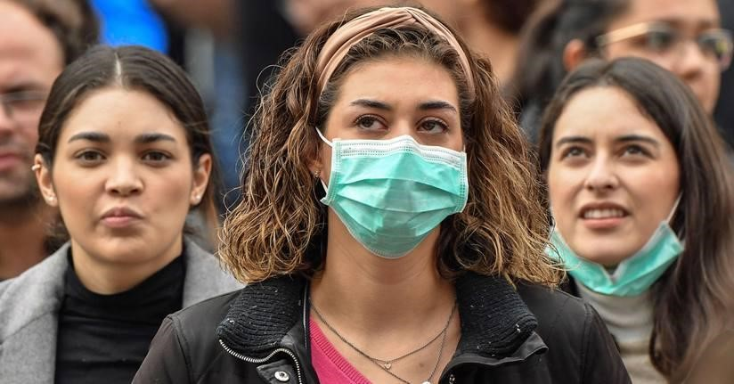

# MASK-DETECTION-SYSTEM-WITH-COVID-UPDATES :star_struck: :mask: :computer: :open_file_folder: :pencil2: :notebook:

[](https://shields.io/) [](https://shields.io/) [](https://shields.io/) [](https://shields.io/) [](https://shields.io/) [](https://shields.io/) [](https://shields.io/) [](https://shields.io/) [](https://shields.io/) [](https://shields.io/) [](https://shields.io/) [](https://shields.io/) [](https://shields.io/) [](https://shields.io) [](https://shields.io) [](https://shields.io) [](https://shields.io) [](https://shields.io) [](https://shields.io)

***This new Mask Detection System and Covid Updates using Python is created by Biswarup Bhattacharjee, student of BTECH, in University of Engineering and Management, Kolkata.***

**Email Id: bbiswa471@gmail.com.** 

**Contact No: 916290272740.** 


<p align="left">
<a href="https://www.facebook.com/profile.php?id=100070395300810" target="blank"></a>
<a href="https://instagram.com/biswarup2210" target="blank"></a>
<a href="https://github.com/biswa2210/biswa2210" target="blank"></a>
</p>

## About MASK-DETECTION-WITH-COVID-NOTIFICATIONS :point_down: 

<div align="justified">
 
This is a ‘Mask Detection System’ based on real world AI and ML applications. The software detects if people are wearing masks or not. It also has a global notification section of covid cases throughout the world. This software is made with Python. Some modules are Tkinter, Pillow, Beautifulsoup, Plyer, Opencv, Pandas, Requests, Itertools etc. A dataset has been used for training and testing data as images of people wearing masks and without masks with mask. We have selected this idea to make project remembering the present covid situation, importance of masks and also the uprising trend of using AI and ML in many real-world practices. Our project ‘MASK DETECTION SYSTEM’ along with ‘COVID UPDATES’ works based on machine learning concepts. There is a GUI canvas which contains background image changing with time. There are three buttons for different functions. The title of the first button is ‘LIVE DETECTION’. Opening it we get a computer vision using web camera and a bounding rect locating the area. Coming in front of webcam we can see the result. The system detects if we are wearing masks or not. It shows accuracy percentage as per prediction and also the number of people before webcam. The system has been cross checked many times with similar things with mask but in each case, we get 99% correct result. To exit the live detection function we have to pree ‘q’ on our keyboard. The next button in the main GUI is ‘COVID UPDATES’. By clicking on this we get a window where we have to write country name and type of covid case. We can select type of cases related Covid-19 like total deaths, total cases, new cases, new deaths, total recovered, all cases. Then we can to click on the show notification button to get a notification pop up in pc. We can also download json or csv format files as record. We have fetched the global updates from worldometer website. The image detection portion is used to chose a image and then count number of people and then for detecting who are wearing masks and who are not. The third button on the main GUI is EXIT which is used to exit the program. 
  
</div>

<details>
 <summary>Click Here to see Types of Covid Related Cases shown in CovidNotification section in this project. </summary>
  - 'total_cases'<br>
  - 'new_cases' <br>
  - 'total_deaths'<br>
  - 'new_deaths' <br>
  - 'total_recovered'<br>
 
 </details>
 
 ## MASK DETECTION SYSTEM DEMO VIDEO: :point_right: <a href="https://www.youtube.com/watch?v=qXZ09CHweTo&list=PL0lbDlMJ1h4jrRuH-A6njkMA3iYmRhxIO&index=4">Click here to watch</a>

## AIML-DL PLAYLIST: :point_right: <a href="https://www.youtube.com/watch?v=K0AAxrbzLFg&list=PL0lbDlMJ1h4jrRuH-A6njkMA3iYmRhxIO">Click here to watch</a>

## CREDITS


**:point_right: [click here to read Project Report](https://drive.google.com/file/d/1hMdAJeS37-HpEpMFpqH3xI1a5vXFUuG1/view?usp=sharing)<br>
:point_right: [click here to see Project PowerPoint Presentation](https://drive.google.com/file/d/1TVcrcimHHs0RM-GMAkX0TthHizkYITZp/view)<br>
:point_right: [click here to view or download Project Demo Video](https://drive.google.com/file/d/17XgQbac67pldqXRNeF50OmqL2wEDpGKX/view)**


## Purpose of MASK-DETECTION-WITH-COVID-NOTIFICATIONS :point_down:

<div align="justified">
 
The main goal of our project is to implement ‘MASK DETECTION SYSTEM’ and ‘COVID UPDATES’ using deep learning concept. For making it user friendly our target is to build a ‘GUI’ with buttons integrated on it for using the system. For the live detection idea, we have to detect faces and also detect the accuracy or wearing or not wearing mask. Based on that we have to produce a decision as the output. We also have to work on image data for training model. For Covid Updates section we have to make a GUI and pop notification as per user’s chosen country and type of covid case. We have to also keep an option to download databases of covid cases. To make correct result and get correct and updated data is also our concern. There should be image detection portion that should detect if people are wearing mask from image and there should be also a count of number of people.
 
</div>

## Applications of MASK-DETECTION-WITH-COVID-NOTIFICATIONS :point_down:

1.	In the ‘Live Detection’ part we can place our face before web-cam of our pc and then it will detect that we are wearing mask or not. The number of people will be shown. More than one person can be detected.
2.	The prediction accuracy of with mask or without mask will be shown. We can clearly get an idea that the person is wearing mask or not. So, in this global Covid-19 pandemic situation this system can be used for safety measures.
3.	This system can be used in offices, schools, colleges, railway station, airport, hospitals, shopping malls and any other places to check that people are wearing masks or not.
4.	In the ‘Global Updates’ part we have to write the name of the country. We can select type of cases related Covid-19 like total deaths, total cases, new cases, new deaths, total recovered, all cases. Then we have to click on the show notification part to see the result. We can also download json or csv format files as record. The records fetched from the worldometer website is accurate.
5.	The notification system can be also used anywhere for database analysis of Covid Cases. Students, researchers, officers or anyone can use this for database and research purpose. This will also help for statistical analysis of records.
6.	The image detection portion counts number of peoples from an chosen image from device and shows who are wearing mask and who are not. This system can be also used as attendance system along with following covid guidelines.

## Future Scopes of MASK-DETECTION-WITH-COVID-NOTIFICATIONS :point_down:

1.	This ‘Face Mask Detection’ system can be deployed in any public place or densely populated areas in checking area before entry for Covid-19 safety measures. It will increase awareness of the global pandemic situation and everyone will know the importance of wearing mask.
2.	This system will make people follow the guidelines related Covid-19 and it will also make the situation better by decreasing the number of affected people.
3.	Many important exams which are getting postponed affecting students’ careers. In future using this system many exams and other important tasks can be conducted avoiding any losses.
4.	The global notification idea can be added in other systems and shown in public places through tv or computer to keep people updated and make them alert for their health.
5.	The development ideas, AIML concepts and other knowledges, the global notification or database part will encourage students or researchers to increase their knowledges.
6. This system can be deployed and more updated to make a attendance system following covid guidelines.

## Folder Structure of MASK-DETECTION-WITH-COVID-NOTIFICATIONS :point_down:

```bash
MASK-DETECTION-WITH-COVID-NOTIFICATIONS
     ├── .idea
     ├── _pycache_  
     ├── dataset
     |      ├── with_mask
     |      └── without_mask
     ├── face_detector
     ├── CoronaGlobalUpdatesGUI.py
     ├── CovidUpdates.py
     ├── Detection.py
     ├── Training.py
     ├── detectMask_image.py
     ├── mask_detection_gui.py
     ├── mask_detector.model
     └── icons, background images, gifs, sounds etc.
     
```                       

## Making of MASK-DETECTION-WITH-COVID-NOTIFICATIONS :point_down:

<div align="justified">

**Dataset**-->I have downloaded external dataset of people’s images with and without masks from Kaggle. The dataset consists 1915 images of people wearing masks and 1918 images of people without wearing masks. In this dataset I have used 80% images as training data and 20% images as testing data.<br>
**Model Training**--> I have created a training.py file for model training. Here I have set learning rate= 1e-4, epoch= 20 and batch size= 32 for my ease in implementation. Here are two categories of data with mask and without mask. For choosing path I have used os.listdir(path). Then I have converted image to array. I have set the size of the images as (224,224). I have used labelbinarizer for labeling and then taken the data as numpy array. Here I have splitted data in trainX, trainY, testX, testY. I have constructed the training image generator for data augmentation. I have used MobileNetV2 network for working with baseModel and headModel. Here I have kept the head of the model that will be placed on top of the base model. Here I have used AveragePooling2D, Flatten, Dense. I have used activation function relu for solving vanishing gradient problem. I have used dropout 0.5 for avoiding overfitting. After all these implementations I have compiled the model and made it to predict based on data. I have saved the model as mask_detector.model. After that I have plotted a hysteresis graph of epoch (X axis) vs loss-accuracy (Y axis) using python matplotlib library. Then I have saved the image as plot.png.<br>
**Detection**-->
We have created detection.py file for detection after prediction. For live detection we have used opencv cv2 in python. Here we have set a frame of detection through live camera streaming. Here we have used an infinite loop for keeping the camera on. Here we have made a bounding rect where users have to place their faces. Here we have measured confidence. If it comes greater than 50% then user is wearing mask. The accuracy percentage is also calculated. Generally, the images are in BGR format of live detection. We made them in RGB format for further implementation. Then after recognition we convert them in grey scale images and also resize them in (224,224). We have kept the sizes of dataset’s images and recognized images same for perfectly comparing them. For recognizing faces a model is also created. The no. of people is also calculated. Our model only makes a prediction if the number of people is greater than 0 or any people is recognized. For live detection we have used VideoStream. Using puttext function we have printed the output, number of people on the screen. After all these we have made a checking if q is pressed then the output screen will be closed using destroyAllWindows function and also stopping the livestreaming. The main functions in this part are livedetect() and detect_and_predict_mask(). <br>
**Covid Updates**--> 
For Covid updates we have created CovidUpdates.py. Here we have used pandas, plyer, beautifulsoup, requests python modules. We have created notifyme function. We have created list of all cases in header. We made a section that scraps real-time data from tbody portion of worldometer website’s source code using html.parser and beautifulsoup module. Notification has been created using plyer module in python. It is the backend portion of corona updates web-scrapping portion in this project. The main functions in this part are notifyMe, getData, downdatascsv, downdatasjson.<br>
**Corona Updates GUI**-->
For the covid updates GUI we have created CoronaGlobalUpdatesGUI.py. It is rthe front end portion for corona updates. The gui window’s height and width cannot be changed it is made fixed. We have used pandas dataframe for downloading the data in JSON (Javascript Object Notation) and CSV (Comma Separated Values). Here we have designed the GUI with fonts, font colors, background images. We have used GIF which seems to be a moving corona virus. We have created the buttons, drop down menu here. We have used labels for designing. We have imported notifyMe,getData,downdatascsv,downdatasjson from covid updates backend. The main functions in this part are globalupdates, shownoti, createCSV and createJSON.<br> 
**Main GUI**--> 
For the main canvas window GUI we have created mask_detection_gui.py. The main gui window is opened in a fixed height and width, it cannot be changed. For playing sound we have used lambda function. Here we have created the four buttons. Here we have designed GUI with changing background image, font, font colors etc. Here using canvas.create_window we have opened the functions of live detection, image detection, covid updates using buttons. We have used lambda functions in the button for adding multiple function calling.<br>
**detectMask_image**-->
This is created for the image detection function. So that clicking on the button image detection user will be given an option to choose a image file in .jpg, .png and .jpeg format from device storage. Here in this portion, we have loaded our models and applied the same logic as detection.py to detect if people are wearing masks or not.  We have used filedialog module for browsing a particular image from storage. If file chosen then it starts detecting and also says “Detecting Start”. We have used pyttsx3 module for talking. After recognising the system also says “Finish Recognising”. Then it also says the “Total number of faces (the counted number) and also shows the number of people wearing mask and not wearing mask. Then it also shows as detection part if persons are wearing mask or not and shows the percentages. Thus, the system not only counts the faces from a choses image but also checks if they are wearing masks or not. The two main functions are imageDetection() and mask_check(). <br>


</div>

## Screenshots of MASK-DETECTION-WITH-COVID-NOTIFICATIONS :point_down: 

<div align="center">
 
<a href="images/mask1.PNG"></a> <a href="images/mask6.PNG"></a>

<a href="images/mask2.PNG"></a> <a href="images/mask3.PNG"></a>

<a href="images/mask4.PNG"></a> <a href="images/mask5.PNG"></a>
 
<a href="images/det1.jpg"></a> <a href="images/det2.png"></a>
 
<a href="images/det3.jpg"></a> <a href="images/det4.png"></a>
 
<a href="images/det5.jpg"></a> <a href="images/det6.png"></a>
 
<a href="images/det7.jpg"></a> <a href="images/det8.png"></a>
</div>

## Diagrams of MASK-DETECTION-WITH-COVID-NOTIFICATIONS :point_down:

<div align="center">

<a href="images/box.png"></a> <a href="images/graph.png"></a>
 
<a href="images/arc.PNG"></a> 
 
 <a href="images/table.PNG"></a>
 
</div>
 

